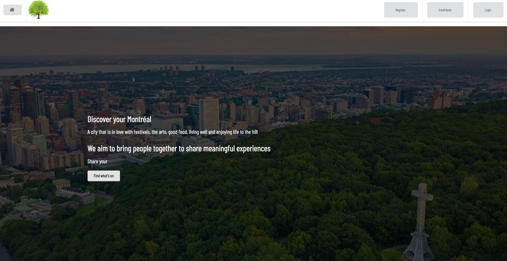
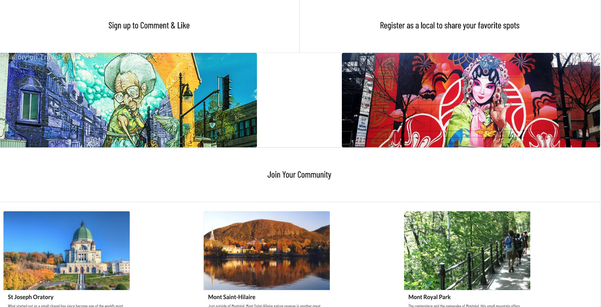
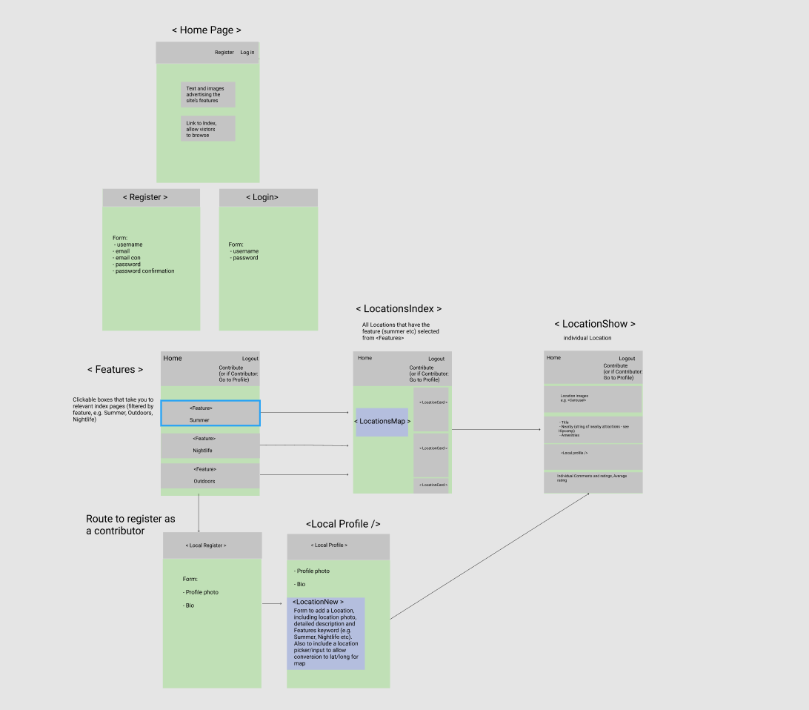
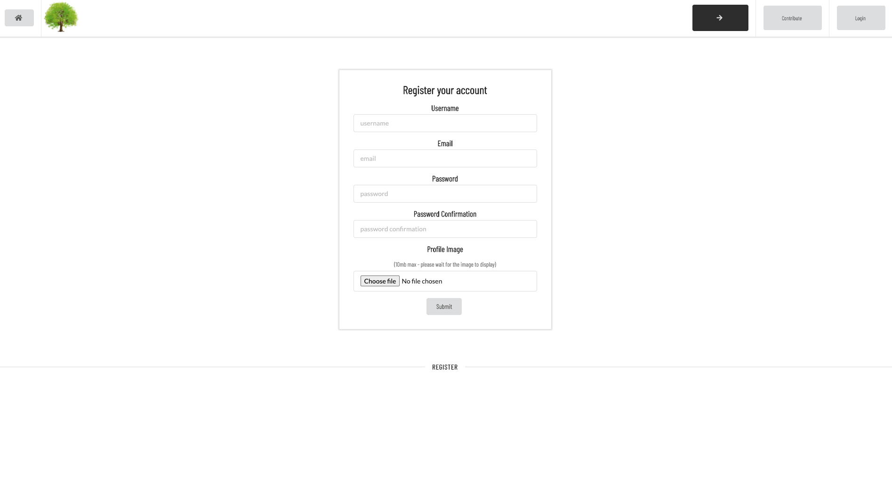
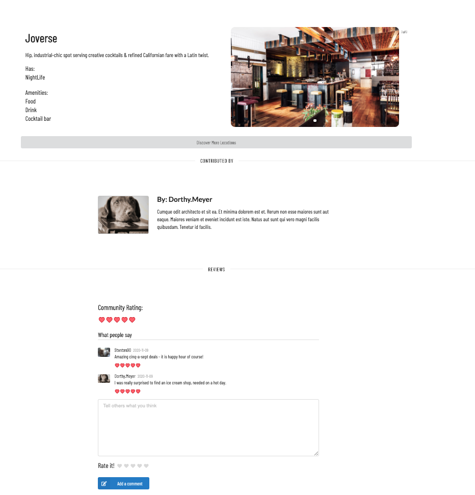

# Discover Your Montréal
This is a a full-stack MERN app, with multiple relationships and CRUD functionality, allowing users to share, rate and comment on attractions in and around the city of Montréal.

Built as part of a team, this is my third project during the Software Engineering Immersive at General Assembly.

### Project Team:
* Anouska Ralph: https://github.com/AnouskaRalph
* Puja Gharti: https://github.com/pu-za
* Simon Neil: https://github.com/Simon994
* Teresa Clark: https://github.com/TClark000


## Goal and Brief
As a group, design and build a full-stack application, using an Express API to serve data from a Mongo database. Consume the API with a separate front end, built with React.

### Timescale:
* 9 days

### Technologies used
* React.js
* Node.js
* Express
* MongoDB/Mongoose
* Semantic UI React
* Axios
* React Mapbox GL
* Nodemon
* HTTP-proxy-middleware
* Bcrypt
* jsonwebtoken
* Git, and GitHub

### Installation
* Clone or download the repo
* Install dependencies: run `npm i` in Terminal
* Start the database: run `mongod --dbpath ~/data/db` in Terminal
* Seed the database either via:
  * running `npm run seed` in Terminal. This will seed the database using the file at ./db/seeds.js
  * running `npm run seedexternal` in Terminal. This will seed the database using the file at ./db/seedexternal.js
* Start the backend server: run `npm run dev`
* Navigate in your browser to `localhost:4000/`. You should see the frontend being served to the browser. 


## The App: Discover Your Montréal
### Live version
https://discover-montreal.herokuapp.com/features

Discover Your Montréal is a MERN stack app designed for a community of users to share information on local attractions in and around Montreal. 
Visitors to the site can browse index and show pages that provide details of  the local attractions, including ratings and comments left by other users.
Users who are registered and logged in can post comments and ratings on locations.
Users can furthermore go through an extra sign-up step to register as Contributors. Contributors have a personal profile and can create new locations, which are then available for other users to view, comment on and rate. 


#### Homepage





 
### General planning and process

We used Figma to create a wireframe, outlining the look of the site,  as well as key components and the user’s journey.
This wireframe was revisited and updated at various points during the project.


The team also used Trello to organise daily tasks (agreed each day at a stand-up meeting), and record various other important aspects of the project as it progressed, such as  bugs and blockers, nice-to-have extra features etc.

#### Wireframe



## Backend

### Models

We built a location model, with coords and comments as embedded data: 

``` javascript
const coordsSchema = new mongoose.Schema({
  latitude: { type: Number, default: 45.5017 },
  longitude: { type: Number, default: -73.5673 } 
})

const commentSchema = new mongoose.Schema({
  text: { type: String, required: true, maxlength: 400 },
  rating: { type: Number, required: true, min: 1, max: 5 },
  local: { type: mongoose.Schema.ObjectId, ref: 'User', required: true }
}, {
  timestamps: true
})

const locationsSchema = new mongoose.Schema({
  
  placeName: { type: String },
  placeDescription: { type: String },
  placePhotos: [{ type: String }],
  amenities: [{ type: String }],
  eventDate: { type: String },
  coords: [coordsSchema],
  feature: [{ type: String }],
  local: { type: mongoose.Schema.ObjectId, ref: 'User', required: true },
  comments: [commentSchema]

}, {
  timestamps: true
})
``` 

We also built a user model (see below), which is referenced by the location model above.
The userSchema below includes a property with a key `isLocal`. Its value is set to `true` when a user registers as a Contributor (a step which requires them to provide a biography). When logged in and `isLocal = true`, the user can view their personal profile. They can also create and delete locations, for other users to view and comment on.


``` javascript
const userSchema = new mongoose.Schema({
  username: { type: String, unique: true, maxlength: 50, required: true },
  email: { type: String, unique: true, required: true },
  password: { type: String, required: true },
  userimage: { type: String },
  bio: { type: String },
  isLocal: { type: Boolean, default: false },
  usertelephone: { type: String }
})

userSchema
  .virtual('createdLocations', {
    ref: 'Location',
    localField: '_id',
    foreignField: 'local'
  })
```

### Routes and Controllers

#### Routes
The app has the following routes, several of which are secure routes that use `jsonwebtoken` for authorization.

``` javascript

//Users can read (get) all locations, and if authorized create (post) new locations
router.route('/locations')
  .get(locations.index)
  .post(secureRoute,locations.create)

//Users can get a single location, and if authorized update and delete locations
router.route('/locations/:id')
  .get(locations.show)
  .put(secureRoute, locations.update)
  .delete(secureRoute, locations.delete)

//If authorized, users can create and delete comments (which are data embedded on the location)
router.route('/locations/:id/comments')
  .post(secureRoute, locations.commentCreate)

router.route('/locations/:id/comments/:commentId')
  .delete(secureRoute, locations.commentDelete)

//If authorized, users can create coordinates (which are data embedded on the location)
router.route('/locations/:id/coords')
  .post(secureRoute, locations.coordCreate)

//Authentication occurs via registration and login routes
router.route('/register')
  .post(auth.register)

router.route('/login')
  .post(auth.login)

//If authorized, users can update their profile
router.route('/profileupdate')
  .put(secureRoute, auth.update)

//If authorized, users can view their profile
router.route('/profile')
  .get(secureRoute, auth.profile)
```

#### ***Register controller***
Registeration creates a `user`. 
``` Javascript
async function register(req, res, next) {
  try {
    const user = await User.create(req.body)
    res.status(201).json({ message: `Welcome ${user.username}` })
  } catch (err) {
    next(err)
  }
}
```


#### ***Login controller***
The login controller returns a token at the backend:

```javascript
async function login(req, res, next) {
  try {
    const user = await User.findOne({ email: req.body.email })
    
    if (!user || !user.validatePassword(req.body.password)){
      throw new Error(unauthorized)
    }
    const token = jwt.sign(
      { sub: user._id },
      secret,
      { expiresIn: '7 days' }
    )
    res.status(202).json({
      message: `Welcome back Glamper ${user.username}`,
      token
    })

  } catch (err) {
    next(err)
  }
}
```


## Frontend

API requests in development were proxied, using `http-proxy-middleware`. 
Following initial work on the backend, the majority of my time was spent developing React components for the frontend.

For authentication, if submission of form data via the `Register` component is successful, this component redirects to the `Login` component. 



When successfully logged-in (and provided a token from the backend, as shown above), the user is subsequently redirected to a Features page, with a few clickable options, which categorise the available locations into: 'summer', 'go-wild' and 'nightlife'. Upon clicking one of these options, the following Route is used: `<Route path='/features/:feature' component={LocationsIndex} />`.  The user is then shown all available locations that fall into the selected category. This is achieved by the `LocationsIndex` component first getting all locations and then filtering by locations matching the route parameter:

```javascript
async componentDidMount() {
    const res = await getLocations()
    const featureSelected = this.props.match.params.feature

    const isFeaturePresent = (feature) => feature.toLowerCase() === featureSelected
    const filteredLocations = res.data.filter((location) => {
      return location.feature.some(isFeaturePresent)
    })

    this.setState({
      featureSelected: featureSelected,
      locationsData: filteredLocations
    })
  }
```

The `LocationsIndex` renders relevant `LocationCard`s, as well as a `LocationsMap`, which uses `react-map-gl`.

The map style used by `LocationsMap` depends on the feature path (summer, go-wild, nightlife).

```javascript
pickMapStyle(featureSelected) {
    if (featureSelected === 'gowild') {
      return 'mapbox://styles/srtn10/ckfzrc12d1crn1alpsr4zljbm'
    } else if (featureSelected === 'nightlife') {
      return 'mapbox://styles/srtn10/ckfzqya7i0i4r19qthsh2mthu'
    } else {
      return 'mapbox://styles/mapbox/outdoors-v11'
    }
  }
```


`LocationCard`'s each link to a page showing further details of the selected location (rendered by `LocationShow`). `LocationShow` also renders the bio of the user who posted the location, as well as -- via a `LocationComments` component-- ratings and comments on the location. If a user is logged in (`isAuthenticated` is true), they are able to add their own comment and rating. An average community rating (provided from the backend) is also shown.



Each single comment is rendered via a component `LocationSingleComment` (a child of `LocationComments`). `LocationSingleComment` includes conditional rendering of a delete button for a user's own posts (via both this conditional rendering, as well as the `locationCommentDelete` controller on the backend, a user can delete only their own posts and not those of other users).


